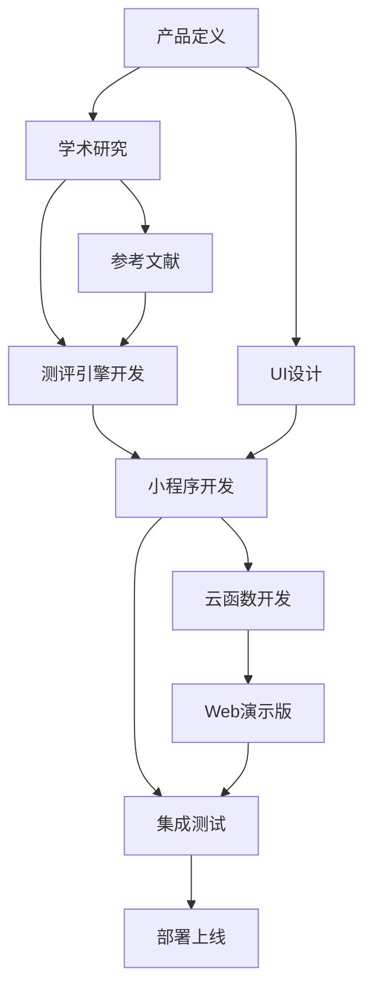

# 简历助手 — 工作流时间线

## 整体结构

## 阶段分解

### Phase 1: 产品定义 (已完成)
- 产品需求文档
- 工作树设计
- 架构设计

### Phase 2: 学术研究与测评设计
- Holland RIASEC 职业兴趣理论综述
- Big Five (OCEAN) 人格理论综述
- Super 职业价值观理论
- 前沿职业心理学研究综述
- 测评问卷设计

### Phase 3: 项目脚手架
- 微信小程序项目结构
- 配置文件
- Cloud Functions 框架
- Web 演示版框架

### Phase 4: UI/UX 设计
- 设计系统 / 色彩 / 排版
- 8 个主要页面设计
- 3 个核心组件设计
- 交互规范

### Phase 5: 核心引擎
- 职业测评计分算法
- JD 解析与关键词提取
- 简历生成提示词工程
- 匹配度计算

### Phase 6: 云函数
- analyzeJob 云函数
- generateResume 云函数
- careerAssess 云函数
- 数据库触发器

### Phase 7: Web 演示版
- 前端 SPA 页面
- 响应式设计
- AI 集成
- 本地调试工具

### Phase 8: 文档与交付
- 项目文档
- 上线清单
- 微信小程序上手指南
- 用户使用手册

## 文件索引

| 文件 | 说明 |
|------|------|
| 产品需求文档.md | 完整产品定义 |
| 工作树.md | 项目工作分解 |
| 架构设计.md | 技术架构文档 |
| weapp/ | 微信小程序源码 |
| cloud-functions/ | 云函数源码 |
| web-demo/ | Web演示版源码 |
| research/ | 学术研究文档 |
| 上线检查清单.md | 上线准备清单 |
| 微信小程序上手指南.md | 开发环境配置 |
| 使用手册.md | 用户使用说明 |
